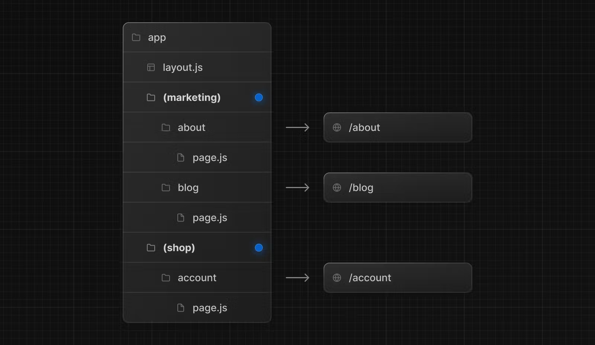

# Routing

The skeleton of every application is routing.

## Creating Routes:

Next.js uses a file-system based router where folders are used to define routes.

```ts
pages / index.js; // Home page
about.js; // About page
contact.js; // Contact page
```

## Creating a simple Nested Routes:

```
pages/
  blog/
    blog1
  products/
    product1  
```

## Dynamic Routes:
A Dynamic Segment can be created by wrapping a folder's name in square brackets: [folderName]. For example, [id] or [slug].


## Route Groups

